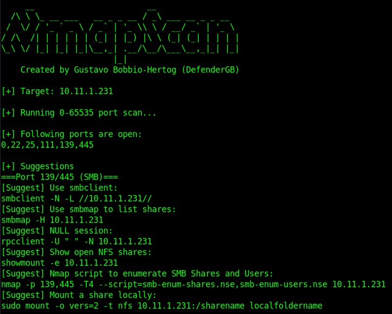
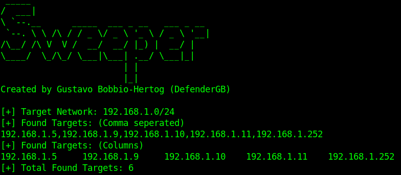
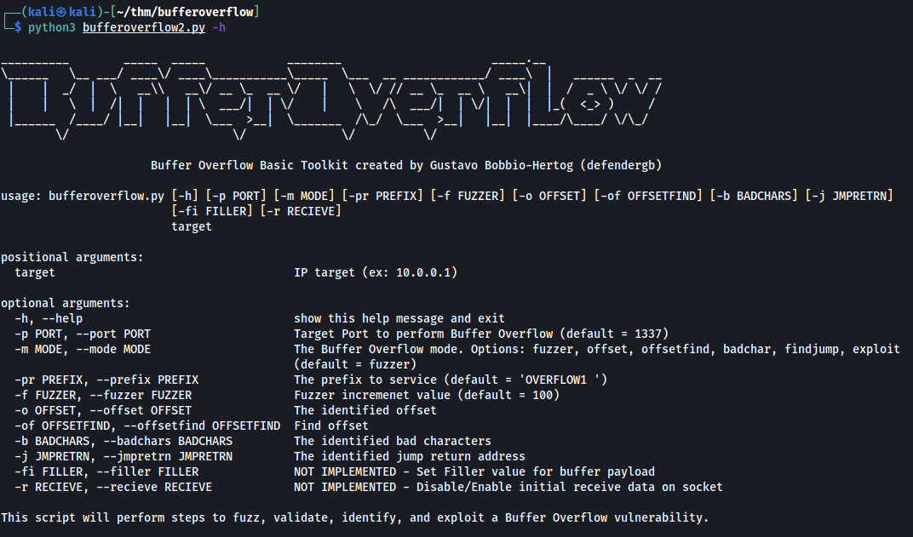

# Scripts

DISCLAIMER: All the scripts/binaries posted on this GitHub should be used for authorized penetration testing and/or educational purposes only. Any misuse of this software will not be the responsibility of the author or of any other collaborator. Use it at your own networks and/or with the network owner's permission.

## UNIX Password Cracker
Pasword cracker created from following Violent Python.

## NmapScan
This bash script performs a TCP nmap scans against a given IP or hostname for all ports (0-65535) then runs a version scan and default scripts scan against open ports (-sV -sC). Each scan will be output their own nmap results (-o). Per my learnings, it will also post suggested tools to run for further enumeration.

Usage: `sudo ./nmapscan.sh 10.0.0.1`

## Sweeper
This bash script performs a network scan that uses ICMP echo, timestamp, and netmask request discovery probes then outputs found targets using column and comma-separated.

Usage: `./sweeper.sh 10.0.0.0/24`

## BufferOverflow Basic Toolkit
This python script can perform steps to fuzz, validate, identify, and exploit a Buffer Overflow vulnerability.

Fuzzer Usage: `bufferoverflow.py 10.0.0.10 --port 1337 --prefix 'OVERFLOW1 ' --mode fuzzer`   
Finding Offset Usage: `bufferoverflow.py 10.0.0.1 --port 1337 --prefix 'OVERFLOW1 ' --mode offset --offset 700`   
Bad Characters Finder Usage: `bufferoverflow.py 10.0.0.1 -p 1337 -pr 'OVERFLOW1 ' -m badchar -o 655 --badchars '\x00\x01'`   
Validate Jump Address Usage: `bufferoverflow.py 10.0.0.1 -p 1337 --prefix 'OVERFLOW1 ' -m findjump -o 655 -b '\x00\x01' -j '\xaf\x11\x50\x62'`   
Exploit Usage: `bufferoverflow.py 10.0.0.1 -p 1337 --prefix 'OVERFLOW1 '-m exploit  -o 655 -b '\x00\x01' -j '\xaf\x11\x50\x62'`   

## More to come!